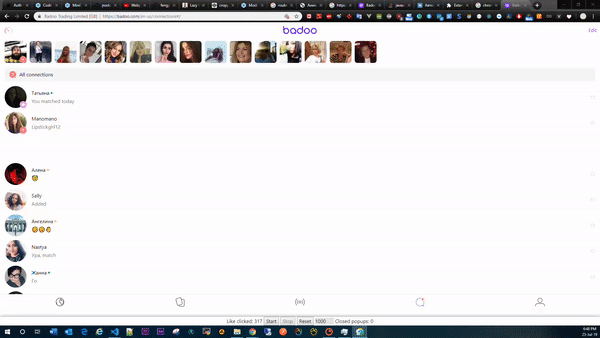

# UPDATE 23 JUL 2019

1. Download & unpack: <a href="https://github.com/kostia7alania/badoo_autolikes_vuejs/archive/master.zip">Badoo autolikes.zip</a>
2. Chrome -> Menu -> - More tools -> Extensions
3. Click on the button "Load unpacked"
4. Choose directory "Dist" (e.g. badoo_autolikes_vuejs\dist)
5. Open https://badoo.com/encounters
6. Press F12, choose Mobile version, Refresh;
7. Click "Start"
8. Enjoy;

[](https://www.youtube.com/watch?v=6yxOiYMv1ac)

Discussion of this topic: https://vk.com/topic-125614288_39159623?post=1058

# Old

9.9.2018

## Расширение хрома для автоматических лайков на Badoo.

```bash
1) Качаем репозиторий с расширением: https://github.com/kostia7alania/badoo_autolikes_vuejs
2) Распаковываем куда-нибудь
3) Заходим в хроме - меню - Дополнительные инструменты - Расширения
4) Нажать кнопку "Загрузить распакованное приложение"
5) Выбираем папку Dist (п.2)
6) Заходим на https://us1.badoo.com/encounters и видим новые кнопки Start / Stop
7) Enjoy;
```

Обсуждение этой темы - https://vk.com/topic-125614288_39159623

<hr>

# Badoo.com auto likes Framework Vue JS

Google's Samples 4 help ->
https://github.com/GoogleChrome/chrome-app-samples<br>
Other Samples 4 help -> https://github.com/Kocal/vue-web-extension

# Usage

[](https://www.youtube.com/watch?v=6yxOiYMv1ac)

# 4 dev

```bash
git clone
npm i
npm run build
```
